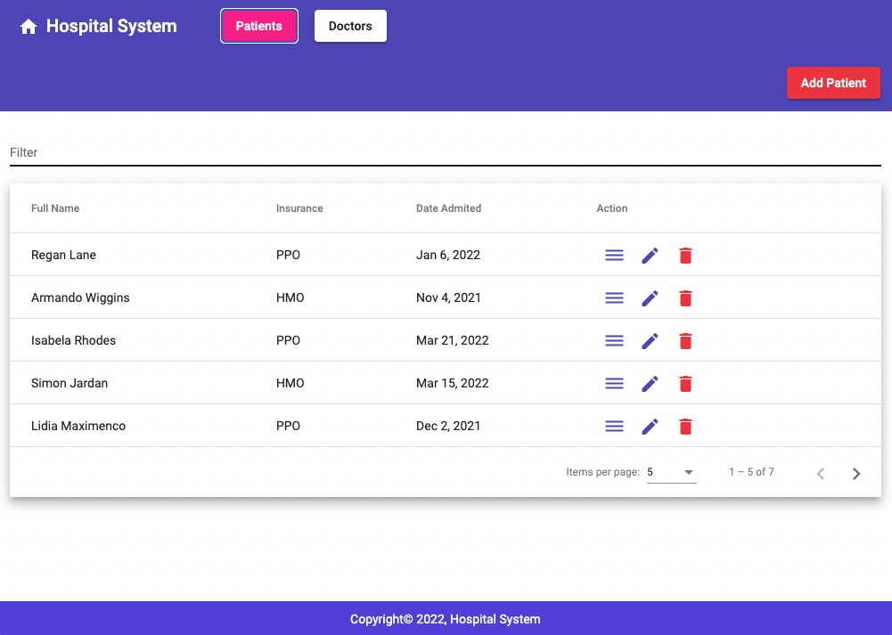
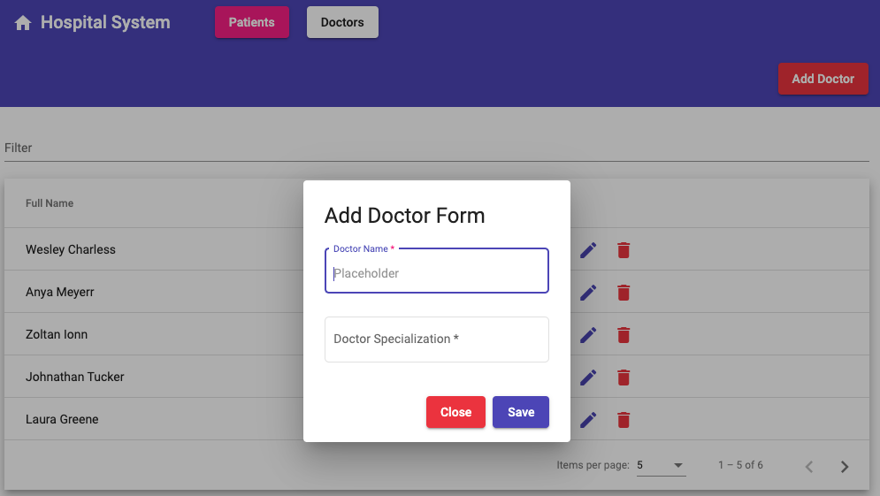

# Hospital System Log

<h1 align ="center">About the Project</h1>

        Hospital system log is a usefull system to register a doctor/patient into the system and have the information 
    fetched in a nice table. It has the features to add add/edit/delete a doctor or patient from the system. It also 
    tracks the patient data about the medical tests and data/time of admision.

## The Aproach

   Then I started my project I did not know exactly how the front end will look like. I started to do some sketches with a 
wireframe and did a lot of google researh about the best practices to achieve my goal. After I finished my back end API I started
a new angular project and installed bootstrap, angular material to help me to move fast. I started with doctor component and kept 
adding functionality fo the TS and html templates. After I tested the component to work properly I moved to the next component 
which is patient. And I followed the pattern for the other components. Adding the backend API to the Heroku cloud was challenging
because of the CORS errors. After some research I fixed the issue by adding a new file for the CORS config on backend java project.
- ### System registration for a hospital.
 

- ### Patient list

- ### Doctor add form

## User Stories

| |
| --- |
|1. As a user, I would like to see all the patients in my system
|2. As a user, I would like to view more details about the patient
|3. As a user, I would like to view/detele/edit a list of doctors.
|4. As a user, I would like to add a doctor.
|5. As a user, I would like to assign a doctor to a patient.
|6. As a user, I would like to see details about a doctor.
|7. As a user, I would like to view/detele/edit a doctor.
|8. As a user, I would like to see a list of patient's tests

## System Tools Used

- Angular
- Angular Material
- Bootstrap
- Heroku
- Node JS
- VS Code
